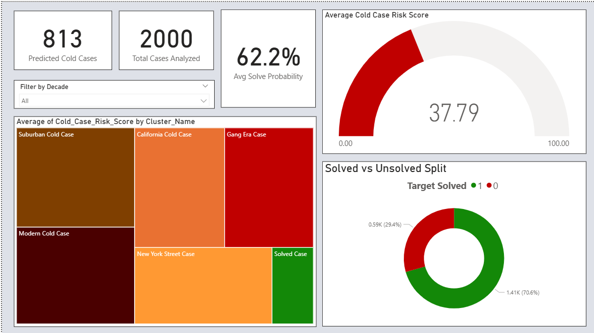
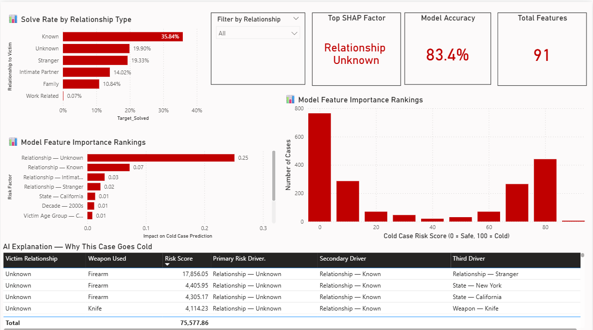
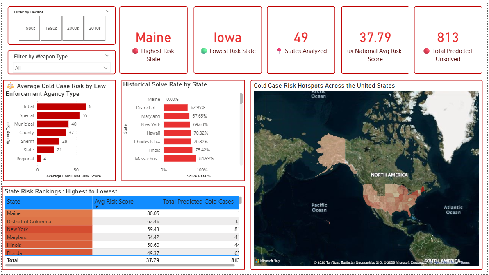
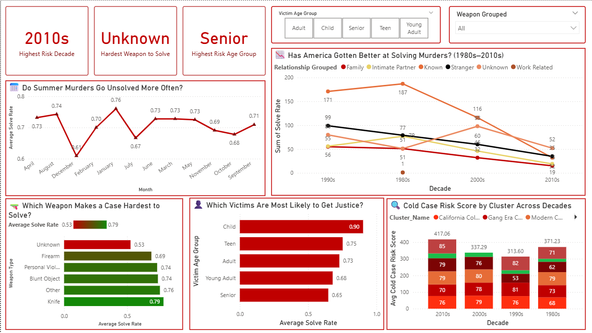

## 📊 Dashboard Preview

### Page 1 — Executive Risk Overview
.

### Page 2 — ML & SHAP Insights  

### Page 3 — Geographic Intelligence

### Page 4 — Pattern & Trend Analysis

## 🔑 Key Findings
- 🔴 Nearly 1 in 3 murders goes unsolved in the US
- 🔴 Relationship to victim explains 57% of whether a case gets solved
- 🔴 Hawaii has the highest cold case risk score
- 🔴 Senior victims are least likely to get justice (65% solve rate)
- 🔴 Child victims most likely to get justice (90% solve rate)
- 🔴 Unknown weapon murders are hardest to solve (53% solve rate)
- 🔴 December murders least likely to be solved
- 🔴 Random Forest model achieved 83.4% accuracy
